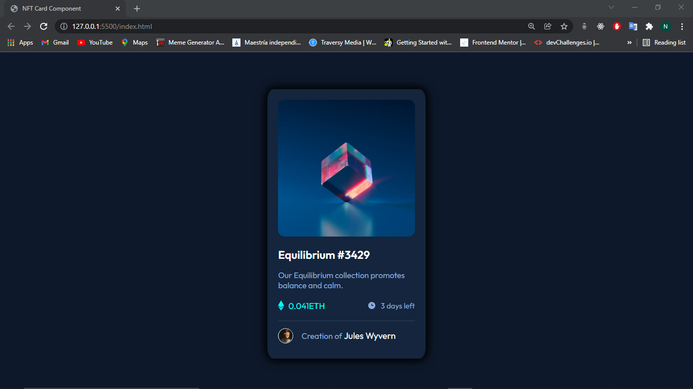
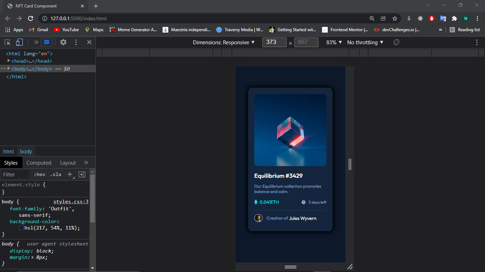
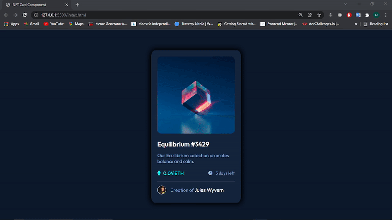

# Componente NFT preview card 

Esta es la solucion a [NFT preview card component challenge on Frontend Mentor](https://www.frontendmentor.io/challenges/nft-preview-card-component-SbdUL_w0U). 

## Contenido

- [Componente NFT preview card](#componente-nft-preview-card)
  - [Contenido](#contenido)
  - [Informacion general](#informacion-general)
    - [Desafios](#desafios)
    - [Screenshot](#screenshot)
    - [Links](#links)
    - [Utilice](#utilice)
    - [Que aprendi](#que-aprendi)
    - [Recursos utiles](#recursos-utiles)
  - [Author](#author)


## Informacion general

### Desafios

Los usuarios deben ser capaces de:

- Ver el diseño óptimo según el tamaño de pantalla de su dispositivo
- Ver estados de desplazamiento para elementos interactivos

### Screenshot






### Links

- Solucion URL : [https://github.com/NicolasGula/NFT-Card-Component](https://github.com/NicolasGula/NFT-Card-Component)
- Sitio URL : [https://nicolasgula.github.io/NFT-Card-Component/](https://nicolasgula.github.io/NFT-Card-Component/)

### Utilice

- HTML5
- CSS
- Flexbox
- Responsive web-design


### Que aprendi

- Utilizar Flexbox para alinear elementos con align-items y justify-content


```css
footer{
    display: flex;
    align-items: center;
    margin-top: 12px;
    font-size: 1em;
}

.items{
    display: flex;
    flex-wrap: wrap;
    align-items: center;
    justify-content: space-between;
    margin: 18px 0;
    font-size: 15px;
}
```

### Recursos utiles

- [CSS FLexbox](https://www.w3schools.com/css/css3_flexbox.asp)
- [Cambiar el grosor de la etiqueta hr](https://stackoverflow.com/questions/4151743/how-can-i-change-the-thickness-of-my-hr-tag) 


## Author

- Website - [Nicolas Gula](https://www.your-site.com)

